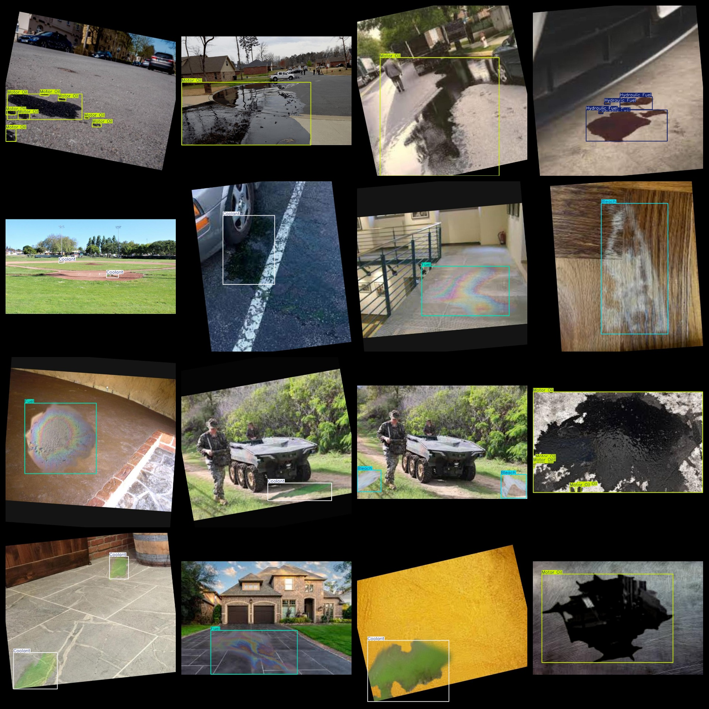
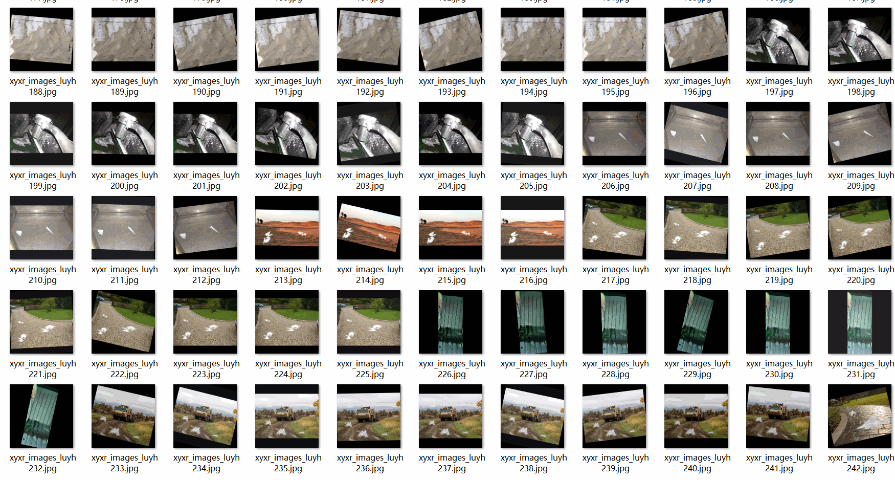

# Industrial Hazard Liquids} Dataset 3341 images8-classVOC+YOLO format

Industrial Hazardous Liquid Dataset 3341 sheets 8 category VOC + YOLO format

Dataset format: Pascal VOC format + YOLO format (the txt file does not contain the split path, it only contains jpg images and corresponding VOC format xml files and yolo format txt files)

Number of images (number of jpg files): 3341

Number of xml files: 3341

Tagged quantity (txt file count) : 3341

Tagged Category Count: 8

The Github repository is: datasets_sl

["Battery Acid", "Bleach", "Coolant", "Fuel", "Hydraulic Fuel", "Isopropyl Alcohol", "Mineral Oil", "Motor Oil"]

Label Chinese Translation: Battery Acid, "Bleach", "Coolant", "Fuel", "Hydraulic Oil", "Isopropyl Alcohol", "Petroleum Oil", "Oil"

Number of boxes labeled in each category:

Battery Acid Frame Count = 643

Bleach Frame Count = 1540

Coolant Frame Count = 878

Fuel Frames = 915

Hydraulic Fuel Frames = 728

Isopropyl Alcohol Frame Count = 118

Mineral Oil Frames = 106

Motor oil specific gravity = 2231

Total frames: 7159

Number of images per category:

Battery Acid occupies 230 pictures.

Bleach occupies 647 images.

Coolant occupies the number of images = 617

Fuel holding picture count = 612

Hydraulic Fuel occupies 454 pictures.

Isopropyl Alcohol has 73 pictures.

Mineral Oil occupies = 105

Motor Oil occupies a picture count = 603

Image resolution: 800x800

Use the labeling tool: labelImg

Dataset Augmentation: Yes

Rules for annotation: Draw a rectangle around the category.

Important note: The dataset does not have been divided into training, validation, and testing sets.

Special Disclaimer: This dataset does not guarantee the accuracy of the trained models or weight files.

Annotation and image details are as follows:

## Images

---

Here is a pay link on Stripe (https://buy.stripe.com/3cs8yP7sY87d0vu9AB). Please contact me lonlonago@foxmail.com after funding $89, and I will send you a complete data files, thank you!

